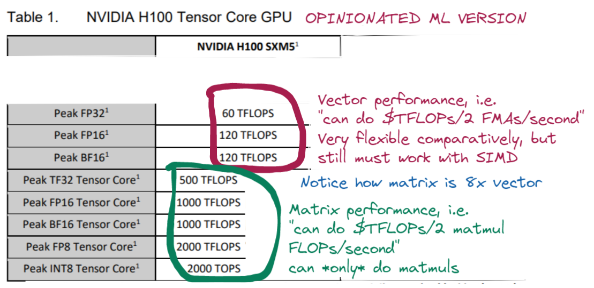

A friend of mine was desperate -- just desperate -- for speedy kernels. She knew the math, she knew the ML, she knew what had to be done. But her kernels were ludicrously slow because she didn't understand the GPU. The GPU is a fundamentally different machine than the CPU, with fundamentally different capabilities, especially with the rise of Tensor Cores and other fixed-function "accelerators within the accelerator". It is difficult to predict and understand what math operations can be made to run quickly on the GPU and why.

## Why are GPUs such a big deal anyway?
The GPU is an accelerator. Its purpose is to make certain computations faster. It does not make most code faster. The vast majority of programs are written for CPUs, and programs written for GPUs are core "inner loop" algorithms that must be very fast. If you compare kernels written for the GPU to, say, React frontend code, you write ~100x less code and spend ~1000x as much time running that code<!--compare to e.g. HFT? or OS kernel?-->. Production Transformer models are a few thousand lines of CUDA that are run for millions of GPU-hours<!-- TODO: fact check this. seems likely -->. When you've been reduced to the point of writing a GPU kernel, you have a desparate need for performance that cannot be slaked by writing the equivalent of Python, so even "[high level](https://docs.nvidia.com/cuda/cuda-c-programming-guide/#cuda-a-general-purpose-parallel-computing-platform-and-programming-model#high-level%20programming%20language:~:text=C%2B%2B%20as%20a-,high%2Dlevel%20programming%20language,-.%20As%20illustrated%20by)" programming languages require a solid understanding of the hardware to achieve acceptable performance.

Because performance analysis on GPUs requires a solid understanding of a somewhat weird machine, I'm going to explain the hardware at the same time as the software.
<!-- TODO: fix this. bad -->

What do GPUs accelerate? Originally graphics (*Graphics* Processing Unit) but now just any<!--asterisk?--> highly <!--not going to explain data parallel or what exactly "parallel" means in this context, e.g. have to have same instruction pointer-->parallel code. There are a few tricks they use to be better at this than CPUs. The main one is that they do away with a lot of things<!-- better term... hardware optimizations? not quite right--> that are not directly related to floating point computation: less [cache](https://en.wikipedia.org/wiki/CPU_cache)<!--TODO: is this still true?-->, less [OOO](https://en.wikipedia.org/wiki/Out-of-order_execution), no [register renaming](https://en.wikipedia.org/wiki/Register_renaming), etc. These features are valuable, and sequential code executes less quickly for their absence. What do you get for this sacrifice? Well the AMD EPYC 9654 has the same number of transistors as the RTX 4090[^1] and costs about ten times as much money[^2] but the RTX 4090 can do ~80 float32 TFLOP/s<!-- TODO: citation --> where the EPYC 9654 can do ~10 float32 TFLOP/s[^3].<!--This is even more extreme if we include Tensor Cores, which bring the 4090 up to ~350 TFLOP/s.-->

<!--citation for AMD EPYC: https://www.hpcwire.com/2022/11/10/amds-4th-gen-epyc-genoa-96-5nm-cores-across-12-compute-chiplets/#:~:text=provides%205.376%20teraflops%20of%20peak%20double%2Dprecision%20performance%20running%20at%20max%20boost%20frequency%20of%203.5%20GHz . It's a shitty citation but nothing talks about its single-precision performance. Seems unlikely, if that's true, to be >2x its double precision performance. -->

<!--
This explanation is true and all we need to know to understand *this* kernel, but it leaves out arguably the most important part of modern GPUs which is the Tensor Cores. Tensor cores are special hardware inside NVIDIA GPUs for doing matrix multiplies.<!--TODO: add citation that they're not systolic arrays, just for fun-->

In order to write code that takes advantage of this incredible speed, we need to be familiar with the hardware. The GPU is a 

 The A100 is divided into many different Streaming Multiprocessors (SMs), each with their own very fast memory called "shared memory" and four Streaming Multiprocessor SubProcessors (SMSPs) which can be thought of for our purposes as 1024 bit wide vector cores (i.e. they do 32 32-bit floating point operations at a time instead of 1 at a time) with Tensor Cores (explained later) and their own registers. They are [barrel processors](https://en.wikipedia.org/wiki/Barrel_processor), which can be thought of as if Hyperthreading with up to 64 threads.

<!-- BARREL PROCESSING IS GOOD BECAUSE IT'S LIKE *AWESOME* HYPERTHREADING AND WE DON'T CARE ABOUT ST PERFORMANCE -->
<!-- REGISTERS MUCH MORE IMPORTANT BECAUSE NO CACHE, SO REGISTERS BIGGER DEAL. ALSO NO REGISTER RENAMING -->
<!-- zen4 has something like 4kb of registers per core? --https://chipsandcheese.com/2022/11/05/amds-zen-4-part-1-frontend-and-execution-engine/ 224 "integer registers" (8 byte?) + 192 "fp registers" (also 8 byte?) ~= 4kb -->

<!-- i should do a redux of Justin Lebar's CPU vs GPU thing and I should say: here's what CPU can do. Here's what GPU can do. Here's what tensor cores can do. -->

<!-- Not going to explain conditional execution, not going to explain what a block is -->

<!-- -->
<!-- TODO: one sentence explanation of what a kernel is, like justin lebar's "data processing step" -->

The most important things to know about the GPU and ML are that 1) [flops are learning](https://twitter.com/jekbradbury) 2) all (85%) of the flops are in the Tensor Cores.

 knew the math, but she -- like many in these parts -- did not understand the GPU (cardinal sin!). So she was reduced to begging me for some way to make her architecture fast.

GPUs are designed for parallel processing, whereas CPUs are designed for sequential <!-- better word than sequential --> processing[^1]. Modern ML is extremely parallel[^2]. Great fit! What does it even mean to be designed for parallel processing? How specifically are they designed?

And lo! I made it fast. But how?

 She begged me: Sophia, please come in, and make my kernels fast, and then write a blog post later on as a form of resume. An

[^1]: 78 billion for AMD EPYC 9654, 76 billion for RTX 4090. It's also *way* more expensive -- $11,000 for 9654, $1,500 for 4090.

[^1]: blah blah blah SMT blah blah blah SIMD blah blah blah
[^2]: Likely in part [because it was created on GPUs](https://arxiv.org/abs/2009.06489)!
